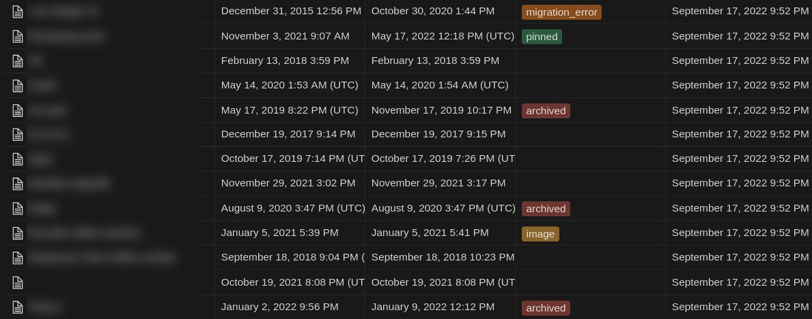

# Google Keep to Notion

## How to use

* Take a [Google Takeout](https://takeout.google.com/) for Google Keep notes.
* Extract the zip file to a temporary location
* Copy all files from `Takeout/Keep` into the folder `keep-data` next to `keep2note.py`
* Rename `.env.sample` -> `.env` and populate the value
  * [Create an internal integration](https://developers.notion.com/docs/getting-started#step-1-create-an-integration) and populate the `NOTION_ACCESS_KEY` with the Internal Integration Token.
  * Create a Database and add this integration using the `Add Connection` option by [following the steps here](https://developers.notion.com/docs/getting-started#step-1-create-an-integration). Then copy paste the URL of the ID of the database.
    * ⚠️ Make sure to add two extra fields in the database created as part of this. They are `Created` and `Edited` (of type Date). These dates are populated to reflect the create and last edit time of the note in Google Keep.
    * Make sure the 'Tags' column exists if not created already.
  * For example: If the address is `https://www.notion.so/your_user_name/9e7f1e7b40cb4121a158846c5b93009d?v=93b29b811eac4775ae41a2e179bfded2` then the ID is `9e7f1e7b40cb4121a158846c5b93009d`
  * If you want to migrate images, then you'll need to host the [image server](./image-server/) app. Then populate the `IMAGE_SERVER_URL` (example: `https://my-image-server.example.com/` <- note the trailing `/`)

* Install required dependencies using pip3: `pip3 install -r requirements.txt`
* Run the script `./keep2note.py`

## A note about image migration

Notion API does not let you upload image to Notion server. As an workaround there are two options,

### Use an image server

This is a different web application (in [image-server](./image-server/) folder) hosted by you to store your images. You then specify the public address using the `IMAGE_SERVER_URL` variable. Each image has it's own UUID generated and the link will be embedded in the imported document.

Notion will download these image when required but they won't cache them for long. So you are expected to keep the server up and running.

### Manually move images

Regardless of whether you specify the `IMAGE_SERVER_URL` variable or not - all imported notes will have the name of the image file at the bottom of note. You can then use the name to search for the file and drag and drop the image from Google Takeout backup.

You can quickly find all notes with image by filtering for the `image` tag.

## Supported notes
- [x] Plain text notes
- [x] To Do Items
- [x] Label Archived and Deleted notes
- [x] Migrate images using an image server to host the images
- [x] Add labels for notes with images, error migrating images.
- [ ] Handle links well
- [ ] Handle large notes (with > 100 lines)
- [ ] Handle large paragraph (with > 2000 characters)
